# 👨‍👩‍👧‍👦 FamilyOS — The Child Development Operating System

> **"The family that runs on an economy, doesn't run on nagging."**

FamilyOS is a mobile-first platform that transforms household management into a gamified family economy. Children earn, bid, save, and grow — while parents get AI-powered insights instead of arguments.

---

## The Problem

Every parent knows the daily battles:

- *"My 10-year-old acts like I'm asking him to climb Everest when I tell him to put his own laundry away."*
- *"Homework time is World War III."*
- *"He's getting aggressive when I take the phone away."*
- *"I feel like a broken record. They don't listen until I yell."*

**Current solutions are fragmented** — one app for chores, another for screen time, another for tracking allowance. None of them talk to each other. None of them motivate children. All of them add to the parent's mental load.

---

## The Solution

FamilyOS replaces nagging with a **Family Economy**. Children don't do chores because they're told to — they do them because they're earning, competing, and growing.

### Core Concepts

| Concept | How It Works |
|---------|-------------|
| **Marketplace** | Chores are jobs posted to a marketplace. Children bid on premium tasks. |
| **Trust Score** | Quality work = higher trust = access to better-paying jobs. |
| **Evidence System** | Before/after photos verify completion. Parent rates quality. |
| **AI Coach** | Private mentor that motivates children with growth-mindset language. |
| **Parent Insights** | AI detects patterns: "Grades dropped after bedtime shifted." |
| **Screen Time Shop** | Children buy screen time with earnings — agency, not punishment. |
| **Academic Tracking** | Grades linked to economy. Study sessions earn coins. |
| **Athlete Mode** | Exercise earns screen time. Sports tracked with streaks. |

---

## Screenshots

### Child Profile Survey
*Personalized onboarding — learning style, special needs, personality, goals*

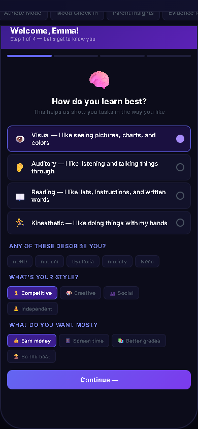

### Parent Dashboard
*Governor view — economy stats, trust scores, mood indicators, AI insights*

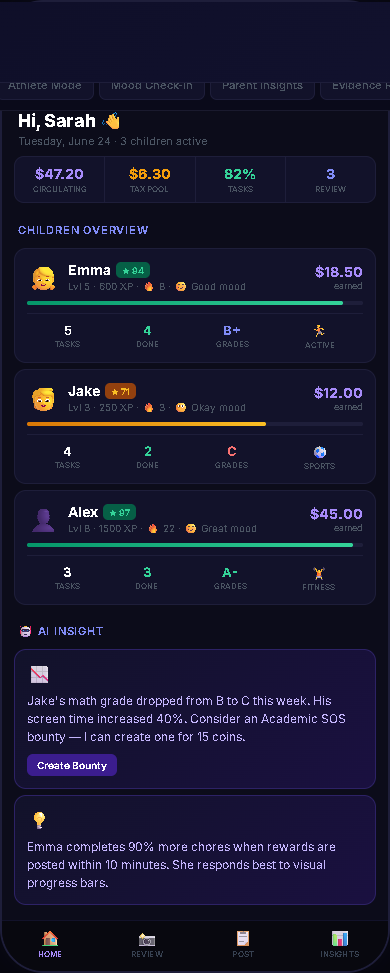

### Child Marketplace
*Job board — premium bounties with bidding, SOS tasks, standard jobs, study bounties*

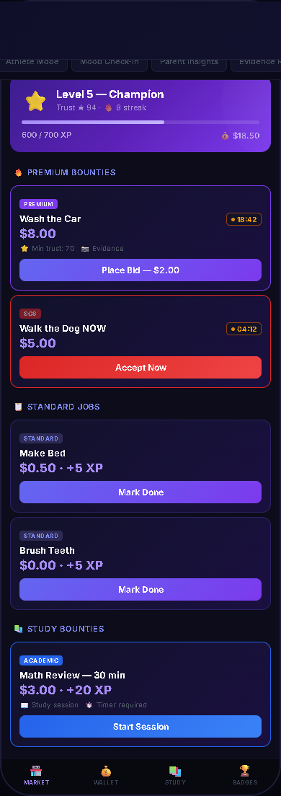

### AI Coach Chat
*Private mentor — growth mindset, privacy firewall, personal nudges*

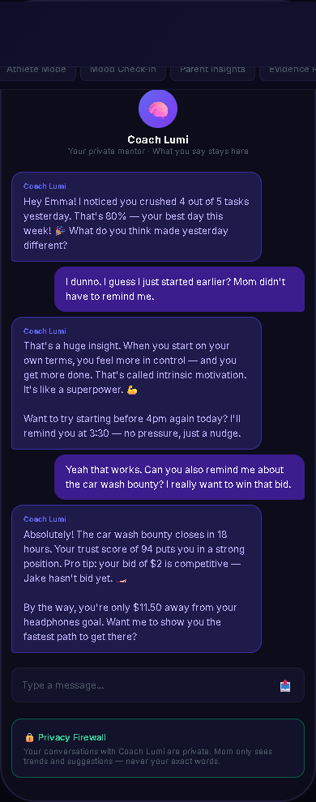

### Academic Tracker
*Subject grades, GPA, reading streak, AI study suggestions*

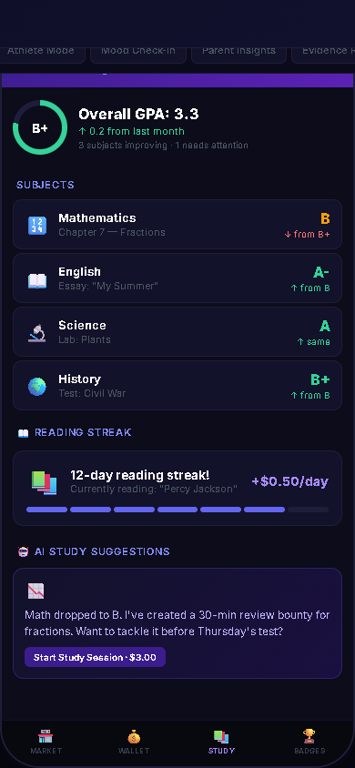

### Athlete Mode
*Sports & fitness — practice tracking, steps, exercise → screen time*

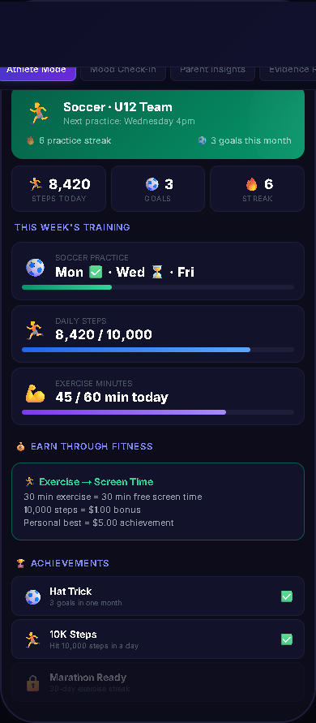

### Mood Check-in
*Daily emotional tracking — private from parents, visible to AI coach*

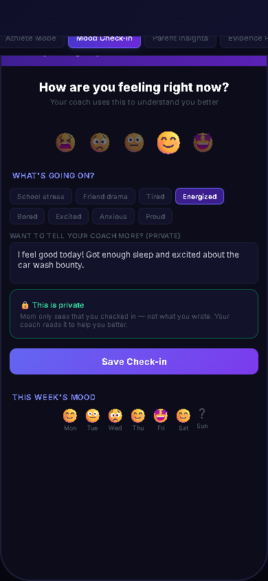

### Parent Insights
*AI-powered observations — correlations, alerts, recommendations*

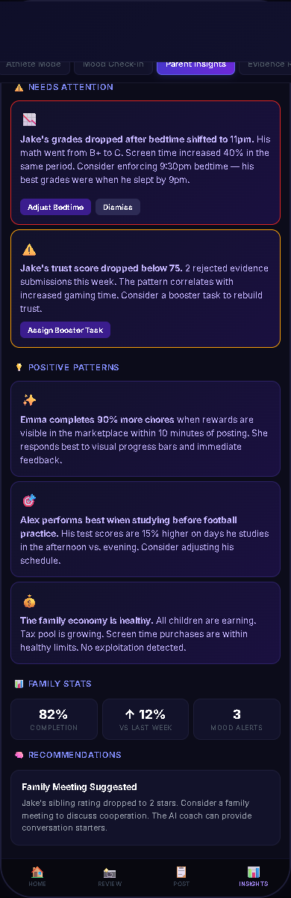

### Evidence Review
*Before/after photos, quality ratings, approve/reject*

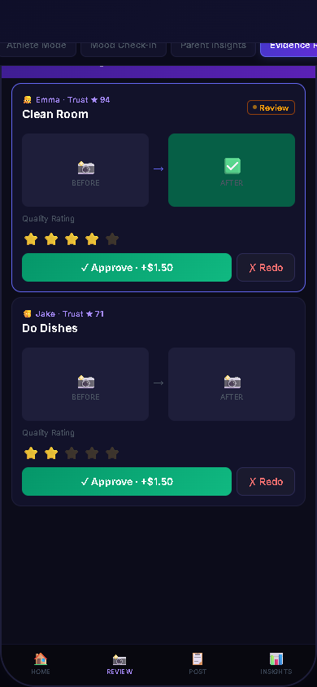

### Wallet
*Balance, tax breakdown, savings goals, transaction history*

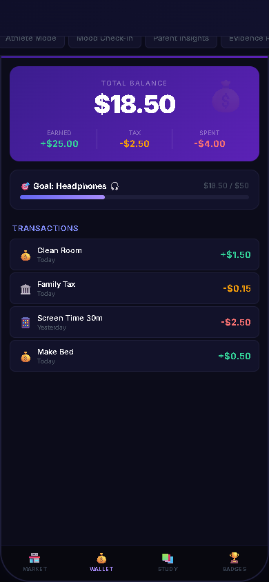

### Screen Time Shop
*Buy screen time with earnings — 30min = $2.50*

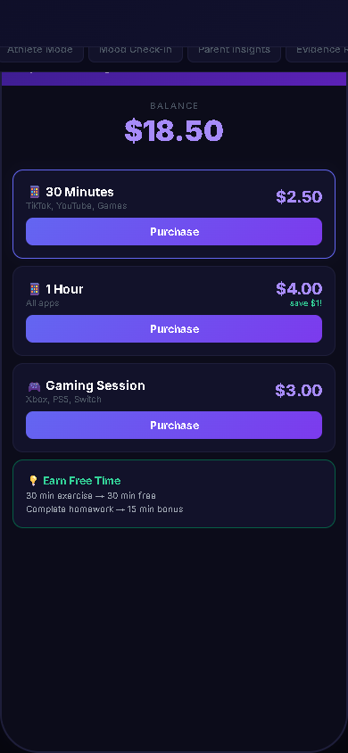

### Reputation Score
*Trust breakdown — what affects it, unlock tiers*

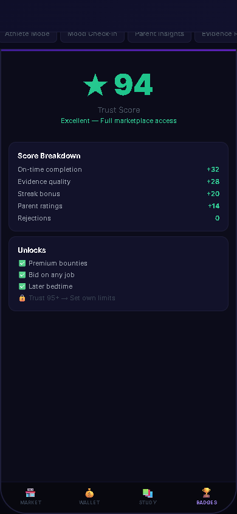

### Achievements & Badges
*Skill tree — Kitchen Assistant, Evidence Pro, Bidding Master*

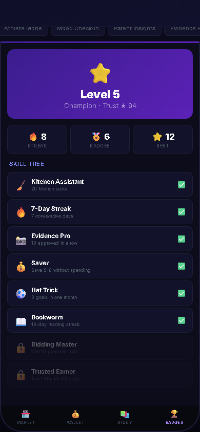

### Authentication Screens

| Login | Child Select | PIN Entry |
|-------|-------------|-----------|
| 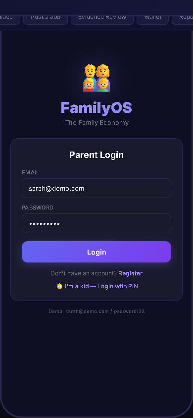 | 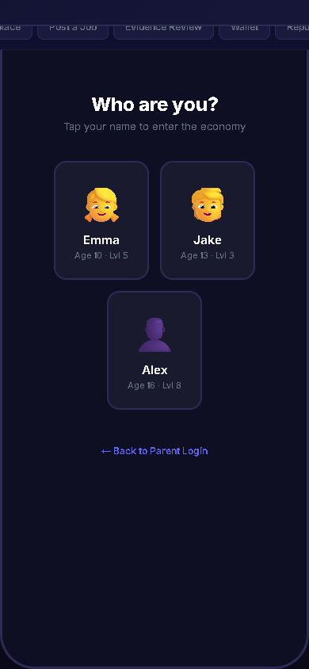 | 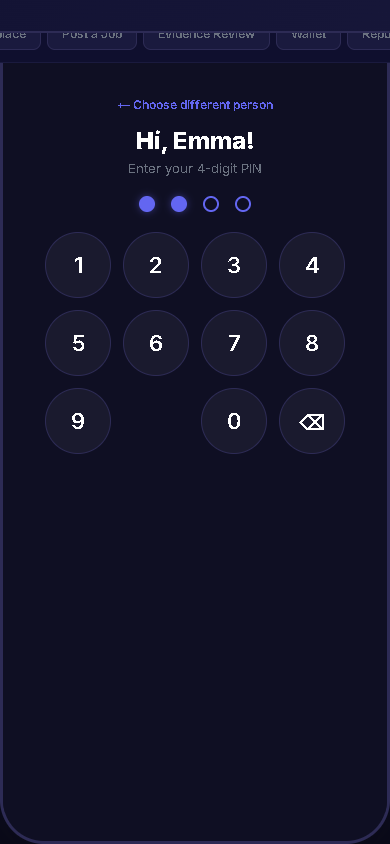 |

### Child Task View

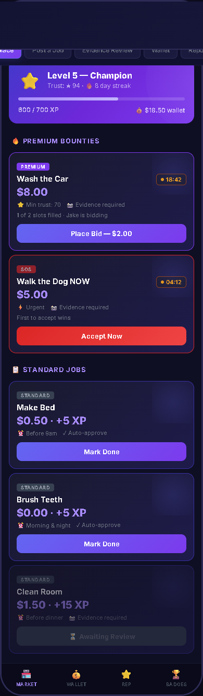

### Job Creator

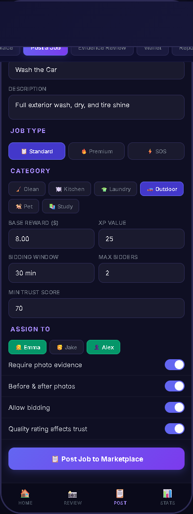

---

## Architecture

```
┌─────────────────────────────────────────────┐
│        Family Performance Dashboard         │
│      (Parent UX: Insights, Config)          │
└─────────────────────────────────────────────┘
                     │
┌─────────────────────────────────────────────┐
│           AI Coach & Nudge Engine            │
│    (Growth-mindset, Privacy Firewall)        │
└─────────────────────────────────────────────┘
                     │
┌──────────┬──────────┬──────────┬──────────┐
│ Economy  │Academic  │Health &  │ Screen   │
│ Engine   │Tracker   │Sports    │ Time Mgr │
│(bid, tax,│(grades,  │(practice,│(exchange,│
│ wallet)  │ rewards) │fitness)  │ caps)    │
└──────────┴──────────┴──────────┴──────────┘
                     │
┌─────────────────────────────────────────────┐
│       Child Profile Engine (Dynamic)        │
│  (Learning style, needs, personality)       │
└─────────────────────────────────────────────┘
                     │
┌─────────────────────────────────────────────┐
│        Evidence & Anti-Fraud Layer           │
│   (Camera, Timestamps, AI Similarity)       │
└─────────────────────────────────────────────┘
```

---

## Tech Stack

| Layer | Technology |
|-------|------------|
| Mobile App | React Native (Expo) |
| Backend | Node.js + Express |
| Database | PostgreSQL (prod) / SQLite (dev) |
| Authentication | JWT + bcrypt |
| AI Engine | OpenAI GPT-4 / Claude |
| Push Notifications | Firebase Cloud Messaging |
| File Storage | AWS S3 (encrypted) |

---

## Security

FamilyOS handles children's data. Security is not optional — it's the foundation.

- **COPPA/GDPR-K compliant** — verifiable parental consent, data minimization
- **AES-256 encryption** at rest and in transit
- **Parameterized queries** — zero SQL injection risk
- **PIN brute force protection** — 3 attempts → lockout
- **Privacy Firewall** — parents never see AI Coach conversations
- **IDOR protection** — every request verified for ownership
- **Rate limiting** on all endpoints

See [SECURITY.md](docs/SECURITY.md) for the full threat model.

---

## Quick Start

```bash
# Clone
git clone https://github.com/yourusername/familyos.git
cd familyos

# Install
cd backend && npm install
cd ../frontend && npm install

# Configure
cp backend/.env.example backend/.env
# Edit backend/.env with your database URL and JWT secret

# Database
cd backend
npm run db:migrate
npm run db:seed

# Run
npm run dev          # Backend on :3001
cd ../frontend
npx expo start       # Frontend on Expo
```

### Demo Logins

| User | Credentials |
|------|------------|
| Parent | `sarah@demo.com` / `password123` |
| Emma (age 10) | PIN: `1234` |
| Jake (age 13) | PIN: `5678` |
| Alex (age 16) | PIN: `9012` |

---

## Project Structure

```
familyos/
├── backend/
│   ├── src/
│   │   ├── db/
│   │   │   ├── connection.js       # Database connection
│   │   │   ├── migrate.js          # Schema creation
│   │   │   └── seed.js             # Demo data
│   │   ├── middleware/
│   │   │   └── auth.js             # JWT authentication
│   │   ├── routes/
│   │   │   ├── auth.js             # Login, register, child PIN
│   │   │   ├── chores.js           # Chore CRUD
│   │   │   ├── assignments.js      # Completion & approval
│   │   │   ├── children.js         # Child management
│   │   │   └── dashboard.js        # Parent dashboard
│   │   └── server.js               # Express server
│   └── package.json
├── frontend/
│   ├── src/
│   │   ├── context/AuthContext.jsx  # Auth state
│   │   ├── lib/api.js              # API client
│   │   ├── lib/constants.js        # Colors, icons
│   │   ├── navigation/             # Routes
│   │   └── screens/                # All screens
│   └── App.js
├── docs/
│   ├── images/screens/             # Wireframe screenshots
│   └── SECURITY.md                 # Security architecture
├── wireframes-v2.html              # Economy simulator wireframes
├── wireframes-v3.html              # Child development OS wireframes
└── README.md
```

---

## Roadmap

- [x] **MVP** — Chore management, gamification, wallet
- [ ] **Phase 2** — Marketplace, bidding, trust scores, evidence
- [ ] **Phase 3** — AI Coach, academic tracking, athlete mode
- [ ] **Phase 4** — Parent insights engine, mood tracking
- [ ] **Phase 5** — Screen time shop, advanced analytics
- [ ] **Phase 6** — School integration, API for third parties

---

## License

MIT License — see [LICENSE](LICENSE) for details.

---

*Built with ❤️ for families who want cooperation, not conflict.*
